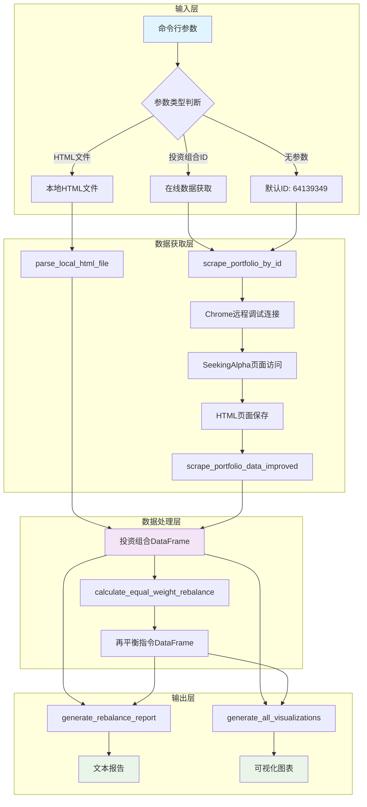
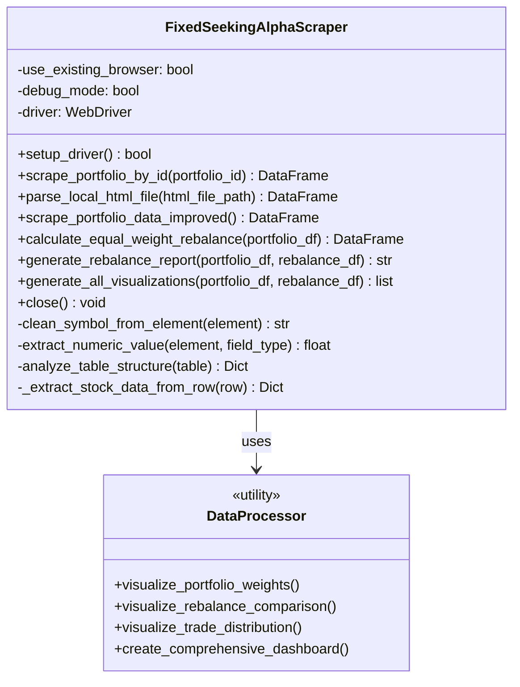
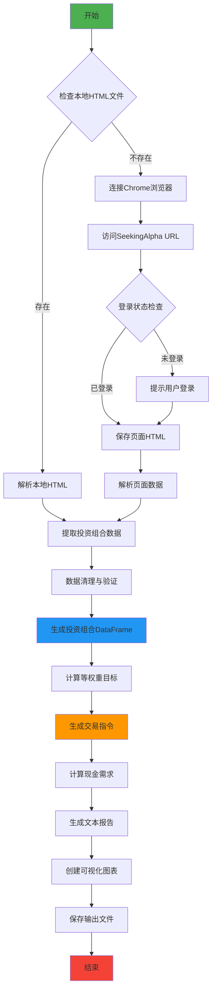
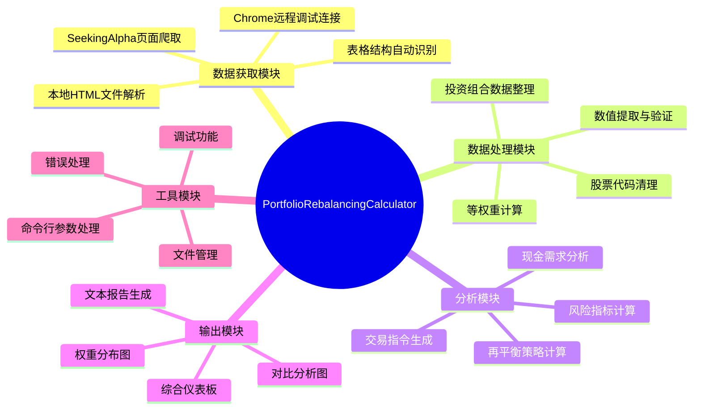
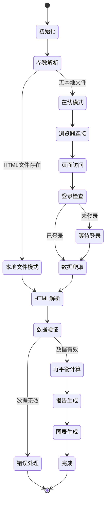
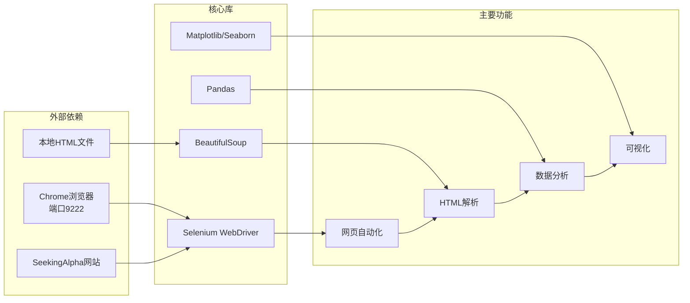

# PortfolioRebalancingCalculator 项目架构文档

本文档详细说明了PortfolioRebalancingCalculator.py的功能设计和技术实现架构。

## 项目概述

PortfolioRebalancingCalculator是一个基于Python和Chrome远程调试架构的SeekingAlpha投资组合数据爬取和等权重再平衡分析工具。

### 🔧 核心架构特点
- **Chrome远程调试依赖**: 所有功能100%基于Chrome远程调试端口9222
- **实时数据获取**: 通过真实浏览器环境从SeekingAlpha获取最新数据
- **会话状态保持**: 利用浏览器已登录状态，无需重复认证
- **反检测设计**: 使用真实浏览器环境，有效规避爬虫检测机制

该工具能够自动从SeekingAlpha网站获取投资组合数据，计算等权重再平衡策略，并生成详细的分析报告和可视化图表。

## 1. 系统架构概览



系统采用分层架构设计，从输入层到输出层依次处理用户请求，确保数据流的清晰性和模块的可维护性。

## 2. 核心类设计



`FixedSeekingAlphaScraper`是核心类，负责数据获取、处理和分析的全流程管理。该类采用单一职责原则，将不同功能模块化。

## 3. 数据流程详解



数据流程设计考虑了离线优先策略，优先使用本地缓存的HTML文件，减少网络请求和提高处理效率。

## 4. 核心算法实现

```mermaid
flowchart LR
    subgraph "HTML解析算法"
        A1[查找table-body] --> A2[分析表格结构]
        A2 --> A3[识别列映射]
        A3 --> A4[逐行提取数据]
        A4 --> A5[清理股票代码]
        A5 --> A6[提取数值字段]
        A6 --> A7[验证数据完整性]
    end
    
    subgraph "等权重再平衡算法"
        B1[计算总资产价值] --> B2[确定目标现金保留]
        B2 --> B3[计算可投资金额]
        B3 --> B4[计算等权重目标值]
        B4 --> B5[对比当前持仓]
        B5 --> B6[生成买卖指令]
        B6 --> B7[计算净现金需求]
    end
    
    subgraph "可视化生成算法"
        C1[权重分布饼图] --> C2[再平衡对比图]
        C2 --> C3[交易分布图]
        C3 --> C4[综合仪表板]
    end
    
    A7 --> B1
    B7 --> C1
```



### HTML解析算法特点：
- **智能表格识别**：自动分析表格结构，识别列映射关系
- **鲁棒数据提取**：多种方式提取股票代码，处理各种异常情况
- **数据验证机制**：确保提取数据的完整性和准确性

### 等权重再平衡算法特点：
- **灵活现金管理**：支持设置目标现金保留比例或固定金额
- **精确交易计算**：精确到股数级别的买卖指令
- **现金流分析**：详细的现金需求和可用性分析
- **🆕 固定现金金额**：支持保留指定固定金额现金，优先级高于百分比
- **🆕 股票清仓功能**：支持指定特定股票完全清仓
- **🆕 清仓资金再投资**：清仓获得的资金自动用于等权重再平衡

## 5. 功能模块组织



模块化设计确保了代码的可维护性和可扩展性，每个模块职责清晰，便于独立测试和优化。

## 6. 程序状态管理



状态管理设计确保程序在各种情况下都能正确处理，包括网络异常、登录失效、数据格式变化等场景。

## 7. 技术架构与依赖



### 技术栈说明：

**核心依赖库：**
- **Selenium**: 用于Chrome浏览器自动化和页面操作
- **BeautifulSoup**: 用于HTML解析和数据提取
- **Pandas**: 用于数据处理和分析
- **Matplotlib/Seaborn**: 用于数据可视化

**外部依赖：**
- **Chrome浏览器**: 运行在远程调试模式（端口9222）- **核心依赖**
- **SeekingAlpha网站**: 数据源，需要用户登录认证
- **本地HTML文件**: 离线数据缓存

### ⚠️ Chrome远程调试架构说明
项目的所有功能都严格依赖Chrome远程调试连接：
- **必须启动**: Chrome必须以 `--remote-debugging-port=9222` 参数启动
- **登录保持**: 需要在Chrome中保持SeekingAlpha登录状态
- **连接复用**: 所有脚本共享同一个Chrome实例和会话
- **实时获取**: 数据直接从网站实时获取，确保最新性

## 8. 使用方式与接口

### 命令行接口
```bash
# 使用默认投资组合ID
python3 src/PortfolioRebalancingCalculator.py

# 使用指定投资组合ID
python3 src/PortfolioRebalancingCalculator.py 64139349

# 分析本地HTML文件
python3 src/PortfolioRebalancingCalculator.py portfolio_data.html
```

### Python API接口
```python
from PortfolioRebalancingCalculator import quick_analyze_portfolio, FixedSeekingAlphaScraper

# 基础快速分析
df, rebalance_df = quick_analyze_portfolio('64139349')

# 🆕 增强功能：固定现金金额
df, rebalance_df = quick_analyze_portfolio(
    portfolio_id='64139349',
    target_cash_amount=12000,  # 保留$12,000现金
    exclude_symbols=['CASH']
)

# 🆕 增强功能：股票清仓
df, rebalance_df = quick_analyze_portfolio(
    portfolio_id='64139349',
    target_cash_percentage=0.05,
    liquidate_symbols=['AEVA', 'EXE'],  # 清仓指定股票
    exclude_symbols=['CASH']
)

# 🆕 增强功能：组合使用
df, rebalance_df = quick_analyze_portfolio(
    portfolio_id='64139349',
    target_cash_amount=15000,  # 固定现金优先
    liquidate_symbols=['APP'],  # 同时清仓
    exclude_symbols=['CASH']
)

# 详细控制
scraper = FixedSeekingAlphaScraper()
df = scraper.scrape_portfolio_by_id('64139349')
rebalance_df = scraper.calculate_equal_weight_rebalance(
    df, 
    target_cash_amount=10000,
    liquidate_symbols=['STOCK1', 'STOCK2']
)
```

## 9. 输出文件说明

### 数据文件
- `portfolio_data_{portfolio_id}.html`: 保存的网页原始数据
- `portfolio_data_{timestamp}.csv`: 投资组合数据表格

### 报告文件
- `portfolio_rebalance_report_{timestamp}.txt`: 详细的再平衡分析报告

### 可视化文件
- `portfolio_weights_pie_{timestamp}.png`: 投资组合权重分布饼图
- `rebalance_comparison_{timestamp}.png`: 再平衡前后对比图
- `trade_distribution_{timestamp}.png`: 交易金额分布图
- `portfolio_dashboard_{timestamp}.png`: 综合分析仪表板

## 10. 扩展与维护

### 可扩展功能点
1. **多种再平衡策略**: 支持风险平价、市值加权等策略
2. **🆕 已实现增强功能**:
   - **固定现金金额保留**: 支持保留指定固定金额现金
   - **股票清仓配置**: 支持指定特定股票完全清仓
   - **清仓资金再投资**: 清仓资金自动用于等权重再平衡
   - **组合功能使用**: 可同时使用多种增强功能
2. **历史数据分析**: 集成历史价格数据进行回测
3. **实时监控**: 添加定时任务和通知功能
4. **多平台支持**: 扩展到其他投资平台

### 维护要点
1. **网页结构变化**: 定期检查SeekingAlpha页面结构更新
2. **错误处理优化**: 增强异常情况的处理能力
3. **性能优化**: 优化大数据量情况下的处理速度
4. **安全性**: 确保登录信息和敏感数据的安全

---

*本文档更新时间: 2025-07-06*
*项目版本: v2.0 (增强功能版)*