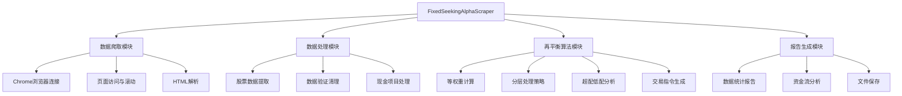
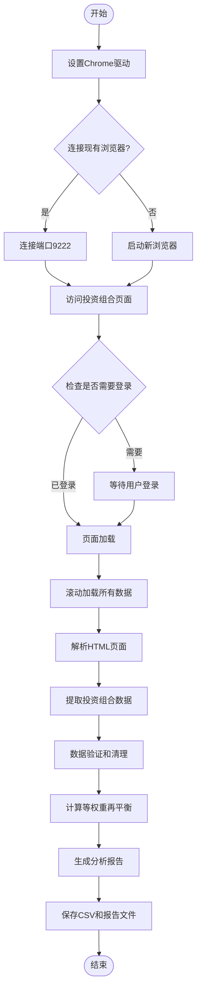
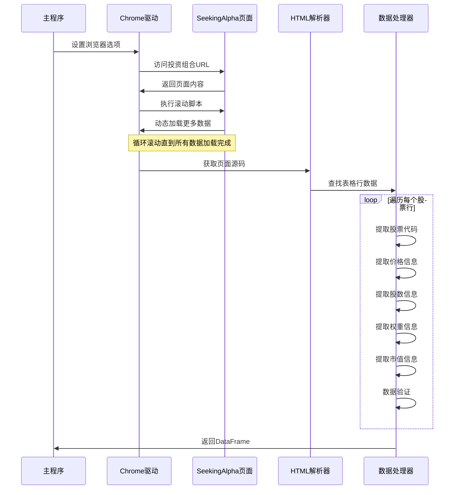
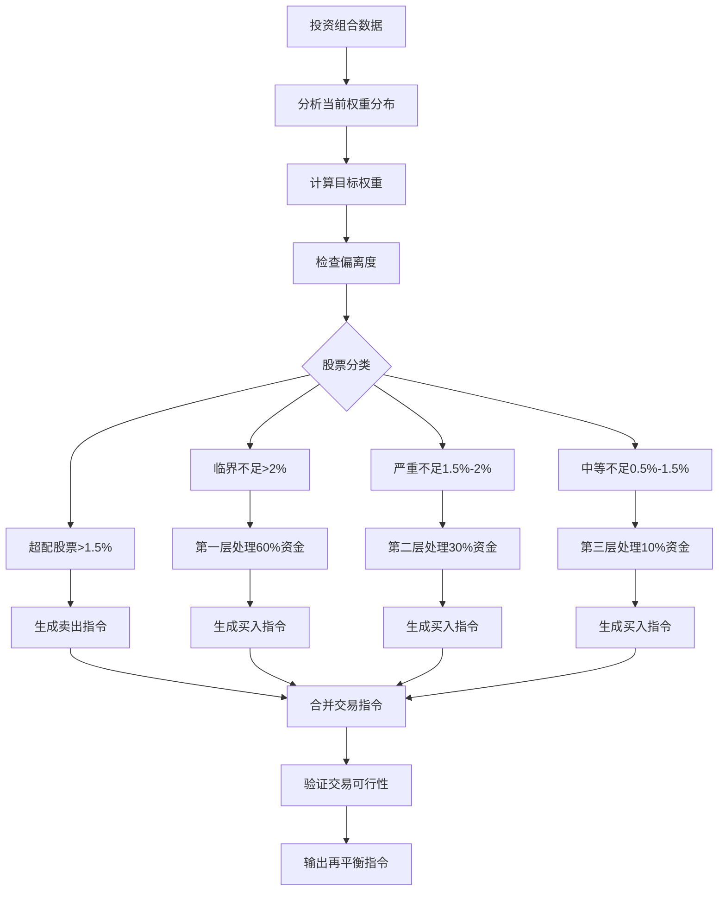
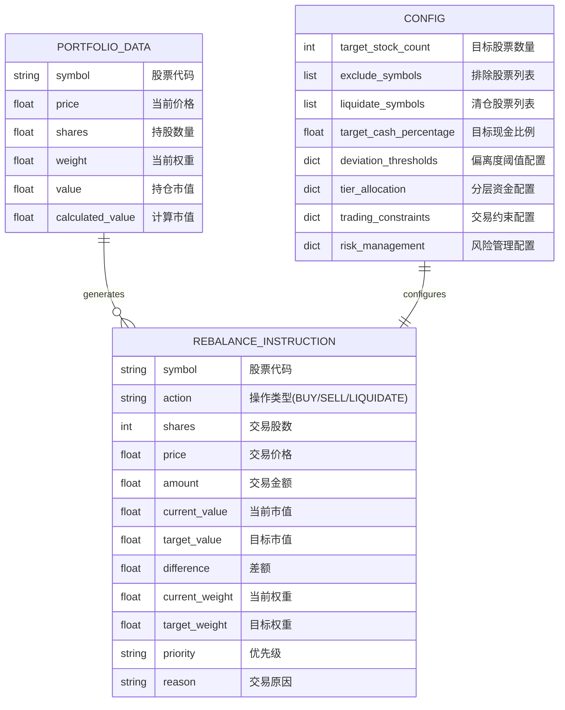

# Portfolio Rebalancing 功能架构文档

本文档详细描述了 `portfolio_rebalancing.py` 的功能设计和实现架构。

## 1. 系统总体架构



### 核心模块说明：

- **数据爬取模块**: 负责连接 Chrome 浏览器，访问 SeekingAlpha 并获取投资组合数据
- **数据处理模块**: 从 HTML 中提取结构化数据并进行验证清理
- **再平衡算法模块**: 实现等权重分层处理策略，生成交易指令
- **报告生成模块**: 生成详细的分析报告和资金流统计

## 2. 主要执行流程



### 执行阶段详解：

1. **初始化阶段**: 设置浏览器驱动，选择连接方式
2. **数据获取阶段**: 访问页面，处理登录，滚动加载数据
3. **数据处理阶段**: HTML解析，数据提取，验证清理
4. **算法计算阶段**: 执行再平衡算法，生成交易指令
5. **报告输出阶段**: 生成报告，保存文件

## 3. 数据提取详细时序



### 关键技术点：

- **智能滚动**: 自动检测页面高度变化，确保加载所有数据
- **多重提取**: 使用多种方式提取同一字段，增强解析鲁棒性
- **实时验证**: 边提取边验证数据完整性和准确性

## 4. 再平衡算法流程



### 分层策略说明：

- **第一层 (60% 资金)**: 处理偏离超过 2% 的临界不足股票，目标改善 70%
- **第二层 (30% 资金)**: 处理偏离 1.5%-2% 的严重不足股票，目标改善 50%
- **第三层 (10% 资金)**: 处理偏离 0.5%-1.5% 的中等不足股票，目标改善 30%
- **超配处理**: 自动卖出偏离超过 1.5% 的超配股票

## 5. 核心数据模型



## 6. 关键功能实现

### 6.1 智能滚动加载
- **功能**: 自动检测页面动态内容，滚动加载所有投资组合数据
- **实现**: `scroll_and_load_all_data()` 方法
- **特点**: 多种滚动方式，智能停止条件，表格行数监控

### 6.2 鲁棒数据提取
- **功能**: 从复杂的 HTML 结构中准确提取股票信息
- **实现**: `_extract_stock_data_from_row_new()` 方法
- **特点**: 多重匹配策略，数据验证，现金项目特殊处理

### 6.3 分层再平衡算法
- **功能**: 根据资金状况和股票偏离度智能分配交易
- **实现**: `_execute_tiered_rebalancing()` 方法
- **特点**: 动态策略选择，资金优化分配，风险控制

### 6.4 完整报告系统
- **功能**: 生成详细的交易指令和资金流分析报告
- **实现**: `generate_rebalance_report()` 方法
- **特点**: 多维度统计，资金流追踪，策略验证

## 7. 配置参数说明

### 7.1 基础配置
- `target_stock_count`: 目标股票数量，影响等权重计算
- `exclude_symbols`: 排除股票列表，不参与再平衡
- `liquidate_symbols`: 清仓股票列表，完全卖出

### 7.2 现金管理
- `target_cash_amount`: 目标固定现金金额（优先级高）
- `target_cash_percentage`: 目标现金比例
- `min_cash_reserve`: 最小现金储备

### 7.3 偏离度阈值
- `critical`: 临界偏离阈值 (2%)
- `severe`: 严重偏离阈值 (1.5%)
- `moderate`: 中等偏离阈值 (1%)
- `minor`: 轻微偏离阈值 (0.5%)

### 7.4 分层配置
- `tier1_budget_ratio`: 第一层预算比例 (60%)
- `tier2_budget_ratio`: 第二层预算比例 (30%)
- `tier3_budget_ratio`: 第三层预算比例 (10%)
- `max_single_stock_ratio`: 单只股票最大资金比例 (15%)

## 8. 使用示例

### 8.1 基本用法
```python
# 使用默认配置
scraper = FixedSeekingAlphaScraper()
df = scraper.scrape_portfolio_by_id("64139349")
rebalance_df = scraper.calculate_equal_weight_rebalance(df)
```

### 8.2 自定义配置
```python
# 自定义配置
config = {
    'target_stock_count': 30,
    'liquidate_symbols': ['STOCK1', 'STOCK2'],
    'target_cash_amount': 5000,
    'deviation_thresholds': {
        'critical': 0.025,  # 调整为2.5%
        'severe': 0.02,
        'moderate': 0.015,
        'minor': 0.01
    }
}

rebalance_df = scraper.calculate_equal_weight_rebalance(df, config)
```

### 8.3 快速分析
```python
# 一键分析
df, rebalance_df = quick_analyze_portfolio(
    portfolio_id="64139349",
    target_stock_count=25,
    liquidate_symbols=['STOCK1', 'STOCK2']
)
```

## 9. 扩展建议

1. **实时监控**: 添加定时任务功能，定期检查投资组合变化
2. **多策略支持**: 增加市值加权、动量策略等其他再平衡方法
3. **风险评估**: 集成更完善的风险管理和波动率分析
4. **API集成**: 连接券商API，实现自动交易执行
5. **可视化界面**: 开发Web界面，提供更友好的用户体验